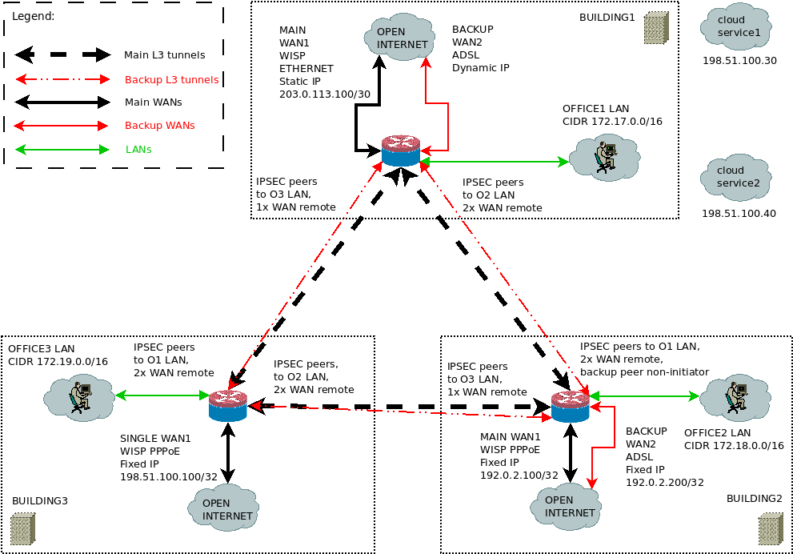

# mikrotik-vpn-triangle

This is a reenactment of a small enterprise setup for connecting three remote offices served by a handful of different (plus failover) ISPs and WAN connection types into a more durable layer 3 IPSEC "VPN triange" using  Mikrotik routers.   
It's not easily scalable but a former client (being overly conservative) insisted on this setup and concept using hardware they already bought, but had no one to set it up for them at that time. I'd happily have used an open source mesh VPN solution between sites and L2TP/IPSec, Wireguard or others with cross-platform VPN client support for "road warriors" instead and a bit more powerful hardware (especially hw crypto-wise).  
The main reason for the upgrade was that the client's previously existing off-the-shelf dual WAN routers had issues (bugs?) with daily DHCP renews initiated by some ISPs and intermittent site-to-site VPN availability.  
I was also involved in the progress of aiding the development, merging and moving their homegrown on-premise software stack to cloud hosts, consultation on local VoIP PBX connection issues plus solving the resulting cloud printing problem. In the end these cloud services doubled as an achor point for reachability monitoring done as connection failover checks from within each router. It could have been done simply by only monitoring ISP gateway addresses too, but that's not very realistic, because it doesn't take an extra failure mode into account where the gateway still responds while public hosts don't.   
*Exported using the command `export file=<filename.rsc> hide-sensitive` to hide security sensitive data.*

Key requirements were:
- Cheap
- Tunnel between every office
- Cloud printing (after cloud migration)
- PPTP road warriors (obsolete and insecure I know)

Features I added:
- WAN redundancy
- Bypass conntrack for stateless ipsec-esp (WAN failover recovery)
- Proper DHCP pool ranges and static allocations (client had a lot of IP conficts caused by mismanagement)
- Service hardening (mac-server and neighbour discovery restricted to LAN, custom port numberings, whitelistings)
- Multi-stage blacklisting protection against brute forcing some 7/24 available service ports
- Key resources monitored via Grafana

#### Brief overview

#### Detailed network environment 
*Note: the reenactment configurations use "fake" public IP addresses, represented using IETF/IANA addresses reserved for documentation purposes.*

- cloud service1 (ERP): 198.51.100.30: (TEST-NET-2)
- cloud service2 (webshop/landing page): 198.51.100.40 is geographically closer and also getting reachability monitored for WAN failover checks by each router (TEST-NET-2)
- road warrior VPN DNS served by two well known different cloud resolvers: 8.8.8.8,1.1.1.1  

*These services are geographically far apart with differing routes to offices.*  

Office1:
- Main WAN static public CIDR: 203.0.113.100/30, GW:203.0.113.101 (TEST-NET-3)
- Backup WAN public CIDR is determined by the pppoe-out.adsl.PPPoE.backup interface
- LAN gateway IP (bridge) CIDR: 172.17.0.100/16
- DHCP pool: 172.17.0.101-172.17.255.254
- Main ISP DNS: 198.51.100.10,198.51.100.20 (TEST-NET-2)
- Bckup ISP DNS: 198.51.100.240,198.51.100.250 (TEST-NET-2)

Office2:
- Main WAN public CIDR: 192.0.2.100/32 (TEST-NET-1)
- Backup WAN public CIDR: 192.0.2.200/32 (TEST-NET-1)
- LAN gateway IP (bridge) CIDR: 172.18.0.100/16
- DHCP pool: 172.18.0.101-172.18.255.254
- Main and backup DNS (identical from the same ISP) 198.51.100.10,198.51.100.20 (TEST-NET-2)

Office3:
- Single public CIDR: 198.51.100.100/32 (TEST-NET-2)
- LAN gateway IP (bridge) CIDR: 172.19.0.100/16
- DHCP pool: 172.19.0.101-172.19.255.254
- Single ISP DNS: 198.51.100.10,198.51.100.20 (TEST-NET-2)

